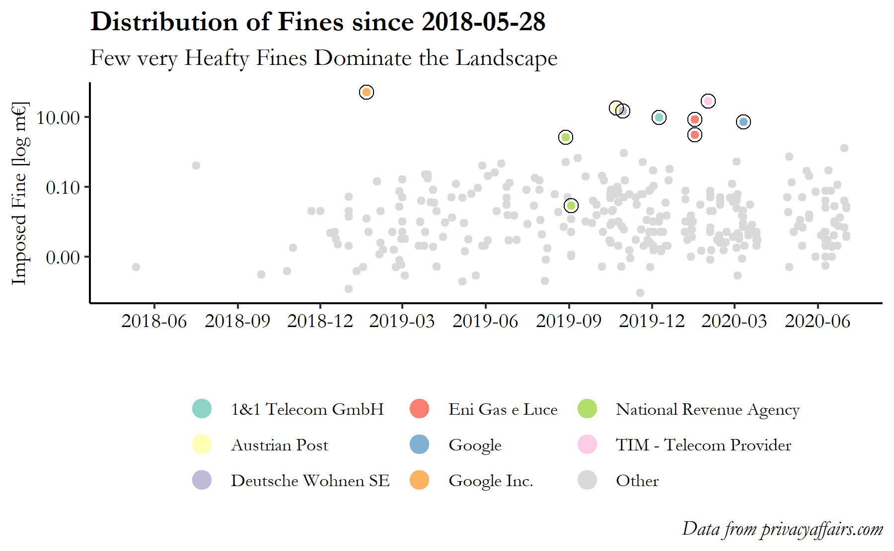
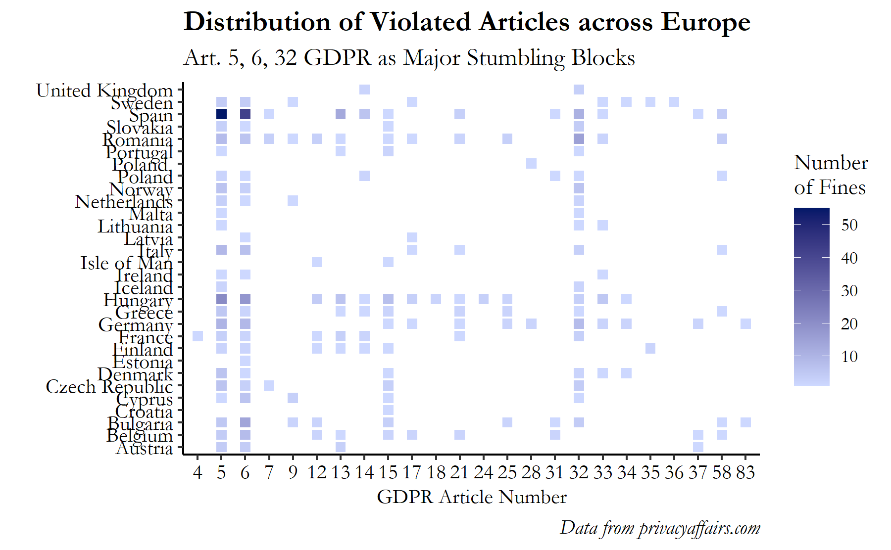
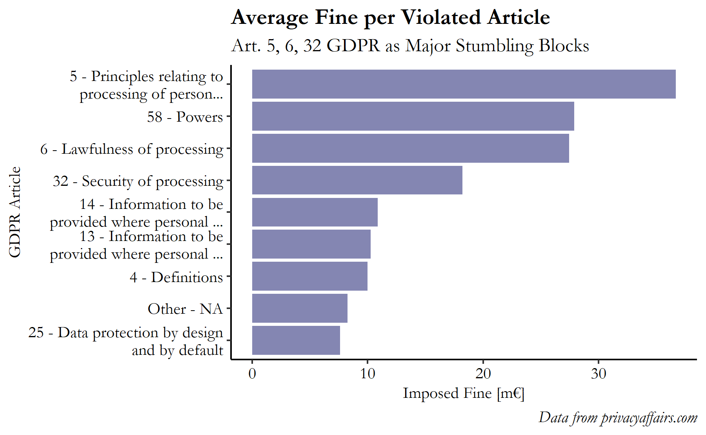
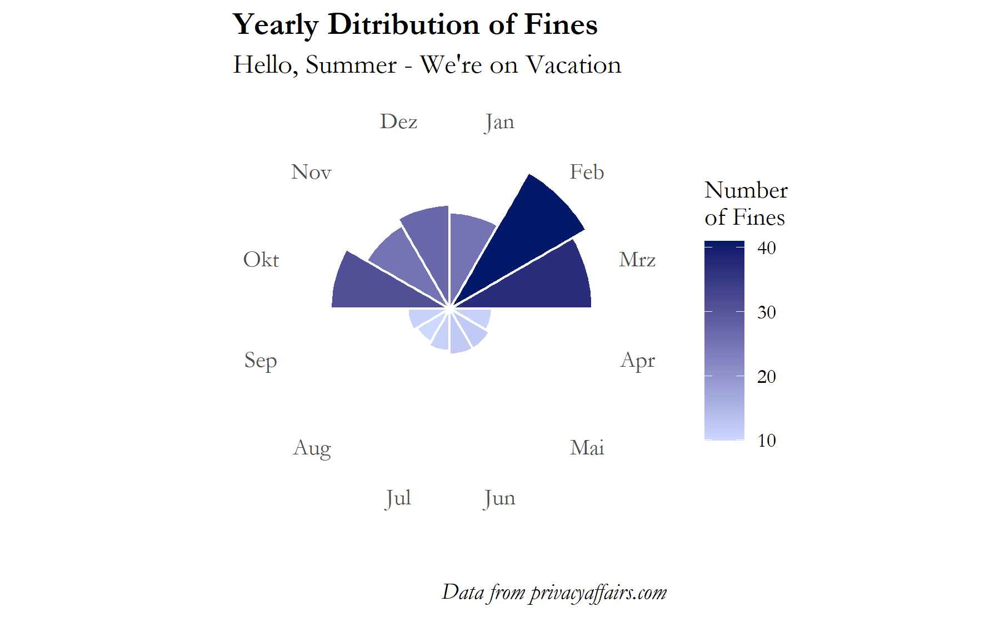

Data Privacy and Data Security, two espoused concepts that gain substantial traction in the current times of Covid-19, especially in the context of the upcoming German Corona tracking app [^1] that is about to be released next week. Public expectations compete with individual reservations and data privacy concerns, partly fueled by events such as the 2013 Snowden revelations or the 2018 Camebridge Analytica scandal. Likewise, events like these contributed to the willingness of the EU to enforce supranational regulations on data privacy and security, climaxing the in the EU-GDPR [^2] which is binding for all EU member states since 2018-05-25.

In this blog post, I would like to take the current debate as an opportunity to dive into a dataset about monetary fines since the issuance of the EU-GDPR. In the process of doing so, I will do some web scraping to extract the dataset from the *GDPR Fines Tracker* on *privacyaffairs.com* [^3], clean the dataset using some of the tools recently released as part of the `dplyr v1.0.0` release [^4], experiment with some fuzzy string matching capabilities provided in the `stringdist` package [^5] and engage in some visual EDA. Meanwhile, this post is inspired by [David Robinson](https://www.youtube.com/watch?v=EVvnnWKO_4w)'s TidyTuesday Series. The whole analysis is embeeded into an R markdown document.


### Load Packages


```r
if (!require("pacman")) install.packages("pacman")
pacman::p_load(rvest, tidyverse, kableExtra, extrafont, stringdist)
```

### Web Scraping

First, I extract the dataset from the *GDPR Fines Tracker* on *privacyaffairs.com* [^3] using the `rvest` package and some regular expression (*regex*) to finally transform the JSON-format into a convenient data frame respectively tibble format.

```r
gdpr_data <- read_html("https://www.privacyaffairs.com/gdpr-fines/") %>% 
  #find html_node that contains the data
  html_nodes(xpath = "(.//script)[2]") %>% 
  #extract text
  rvest::html_text() %>%
  #trim to produce clean json format
  str_sub(start = str_locate(., "\\[")[[1]], end = str_locate(., "\\]")[[1]]) %>% 
  #remove new lines and carriage returns
  str_remove_all(paste("\\n", "\\r", sep = "|")) %>% 
  #parse JSON
  jsonlite::fromJSON()
```

In total, 339 violations are categorized by *PrivacyAffairs* as of the day of this blogpost (2020-07-12). I randomly sample five observations to get a first overview of the dataset.


```
>    id           name  price
> 1   6        Romania  20000
> 2  86 United Kingdom      0
> 3 113          Spain    900
> 4  87 United Kingdom  80000
> 5 306         Norway 283000
>                                                                        authority
> 1 Romanian National Supervisory Authority for Personal Data Processing (ANSPDCP)
> 2                                                       Information Commissioner
> 3                                       Spanish Data Protection Authority (AEPD)
> 4                                                       Information Commissioner
> 5                                 Norwegian Supervisory Authority (Datatilsynet)
>         date                                 controller
> 1 10/09/2019                           Vreau Credit SRL
> 2 07/10/2019 Driver and Vehicle Licensing Agency (DVLA)
> 3 11/07/2019                       TODOTECNICOS24H S.L.
> 4 07/16/2019                    Life at Parliament View
> 5 05/19/2020                        Bergen Municipality
>                    articleViolated
> 1       Art. 32 GDPR, Art. 33 GDPR
> 2                          Unknown
> 3                     Art. 13 GDPR
> 4         Data Protection Act 2018
> 5 Art. 5 (1) f) GDPR, Art. 32 GDPR
>                                                                      type
> 1 Failure to implement sufficient measures to ensure information security
> 2                                            Non-compliance (Data Breach)
> 3                                   Information obligation non-compliance
> 4                                            Non-compliance (Data Breach)
> 5 Failure to implement sufficient measures to ensure information security
>                                                                                                                                      source
> 1                                                                    https://www.dataprotection.ro/?page=Comunicat_Presa_09_10_2019&lang=ro
> 2              https://www.autoexpress.co.uk/car-news/consumer-news/91275/dvla-sale-of-driver-details-to-private-parking-firms-looked-at-by
> 3                                                                                    https://www.aepd.es/resoluciones/PS-00268-2019_ORI.pdf
> 4 https://ico.org.uk/about-the-ico/news-and-events/news-and-blogs/2019/07/estate-agency-fined-80-000-for-failing-to-keep-tenants-data-safe/
> 5
```

### Data Cleaning

In a next step, I streamline the dataset a little more and try to get rid of the various inconsistencies in the data entries. 

First, I would like to adjust some of the column names to highlight the actual content of the features. I rename `name` to `country`, `controller` to `entity` (i.e. the entity fined as a result of the violation) and `articleViolated` to `violation`. Second, I infer from the sample above that the violation `date` is not in standard international date format (`jjjj-mm-dd`). Let's change this using the `lubridate` package while properly accounting for 15 `NA`s (indicated by unix time `1970-01-01`). Third, I format the `price` feature by specyfing it as a proper currency (using the `scales` package). Fourth, and analogue to the violation `date`, I properly account for `NA`s -- taking the form "Not disclosed", "Not available" and "Not known" -- in the `entity` as well as `type` feature (containing 38 and 2 missing values, respectively). In addition, I must correct one errorneous fined entity (violation id 246). Finally, I clean the `violation` predictor using regex and the `stringr` package.

```r
gdpr_data <- gdpr_data %>% 
  rename(country = name, entity = controller, violation = articleViolated) %>% 
  mutate(across(date, ~na_if(lubridate::mdy(.), "1970-01-01"))) %>% 
  mutate(across(price, ~if_else(. == 0, NA_integer_, .))) %>% 
  mutate(across(c(entity, type), ~if_else(str_detect(., "Unknown|Not"), NA_character_, .))) %>% 
  mutate(across(entity, ~str_replace(., "https://datenschutz-hamburg.de/assets/pdf/28._Taetigkeitsbericht_Datenschutz_2019_HmbBfDI.pdf", "HVV GmbH"))) %>% 
  mutate(across(violation, ~if_else(is.na(str_extract(., ">.+<")), ., str_extract(., ">.+<") %>% str_sub(., 2, -2)))) %>%
  mutate(across(c(violation, authority), ~str_replace_all(., "\\t", "")))
```

Since a cross-check of the entity names reveals quite a few inconsistencies in how the entities have been written in the databse, I leverage the `stringdist` package [^5] for fuzzy string matching to homogenize some of the entries. For example, the *optimal string alignment* (*osa*) measure allows to assess the similarity of two strings by enumerating the number of pre-processing steps (deletion, insertion, substitution and transposition) necessary to transform one string into another. Adhering to the following assumptions yields several fuzzy matches which are accounted for in the subsequent EDA:
* Set the minimum-osa threshold to 3 (i.e. only consider string pairs which require three transformations to be aligned).
* Only consider strings of length > 3 (otherwise the minimum-osa threshold becomes redundant).

```
> # A tibble: 9 x 5
>   ent_a                          ent_b                           osa  id.a  id.b
>   <chr>                          <chr>                         <dbl> <int> <int>
> 1 Telecommunication Service Pro~ Telecommunication service pr~     2     7    48
> 2 A mayor                        Mayor                             3    32   100
> 3 A.P. EOOD                      L.E. EOOD                         2    45   204
> 4 A.P. EOOD                      T.K. EOOD                         2    45   205
> 5 A bank                         Bank                              3    50    55
> 6 A bank                         bank                              2    50   225
> 7 Bank                           bank                              1    55   225
> 8 Vodafone Espana                Vodafone España                   1    64   156
> 9 L.E. EOOD                      T.K. EOOD                         2   204   205
```


```r
gdpr_data <- gdpr_data %>% 
  mutate(across(entity,
                ~str_trim(.) %>% 
                  str_replace_all(.,
                    c("Telecommunication Service Provider" = "Telecommunication service provider",
                      "A mayor" = "Mayor",
                      "A bank" = "Bank",
                      "bank" = "Bank",
                      "Vodafone Espana" = "Vodafone España")))
                )
```

Finally, let's have a look at the cleaned data.

```
>    id        country  price
> 1   6        Romania  20000
> 2  86 United Kingdom     NA
> 3 113          Spain    900
> 4  87 United Kingdom  80000
> 5 306         Norway 283000
>                                                                        authority
> 1 Romanian National Supervisory Authority for Personal Data Processing (ANSPDCP)
> 2                                                       Information Commissioner
> 3                                       Spanish Data Protection Authority (AEPD)
> 4                                                       Information Commissioner
> 5                                 Norwegian Supervisory Authority (Datatilsynet)
>         date                                     entity
> 1 2019-10-09                           Vreau Credit SRL
> 2 2019-07-10 Driver and Vehicle Licensing Agency (DVLA)
> 3 2019-11-07                       TODOTECNICOS24H S.L.
> 4 2019-07-16                    Life at Parliament View
> 5 2020-05-19                        Bergen Municipality
>                          violation
> 1       Art. 32 GDPR, Art. 33 GDPR
> 2                          Unknown
> 3                     Art. 13 GDPR
> 4         Data Protection Act 2018
> 5 Art. 5 (1) f) GDPR, Art. 32 GDPR
>                                                                      type
> 1 Failure to implement sufficient measures to ensure information security
> 2                                            Non-compliance (Data Breach)
> 3                                   Information obligation non-compliance
> 4                                            Non-compliance (Data Breach)
> 5 Failure to implement sufficient measures to ensure information security
>                                                                                                                                      source
> 1                                                                    https://www.dataprotection.ro/?page=Comunicat_Presa_09_10_2019&lang=ro
> 2              https://www.autoexpress.co.uk/car-news/consumer-news/91275/dvla-sale-of-driver-details-to-private-parking-firms-looked-at-by
> 3                                                                                    https://www.aepd.es/resoluciones/PS-00268-2019_ORI.pdf
> 4 https://ico.org.uk/about-the-ico/news-and-events/news-and-blogs/2019/07/estate-agency-fined-80-000-for-failing-to-keep-tenants-data-safe/
> 5
```

Now let's briefly validate the integrity of the scraped dataset.

```
> # A tibble: 1 x 11
>      id picture country price authority  date entity violation  type source
>   <int>   <int>   <int> <int>     <int> <int>  <int>     <int> <int>  <int>
> 1     0       0       0    11         0    15     38         0     2      0
> # ... with 1 more variable: summary <int>
```

And indeed, a quick glance at the missing values per feature reveals numerous missing values for the `price` (3.24%), `date` (4.42%) and `entity` (11.21%) feature. Without diving deeper into the information sources, it may be assumed that for the affected court cases no complete record of the verdict was openly published by the jurisdiction.

Also, with regards to some of the fines, *PrivacyAffairs* explicitely states that "*The Marriott and British Airways cases are not final yet and the fines are just proposals. Other GDPR fines trackers incorrectly report those as final.*"

### Exploratory Data Analysis


Finally, the cleaned data allows for some interesting exploratory data analyses. In a first step, the data reveals the *Bulgarian Commission for Personal Data Protection* as the first ever authority imposing a punishment for the violation of the GDPR on 2018-05-12. Comparing this date to the enactment of the GDPR (2018-05-25) it raises the question how a fine could have been imposed 13 days prior to the GDPR coming into effect.

```r
gdpr_data %>% 
  select(-summary, -picture) %>% 
  filter(date == min(date, na.rm = TRUE))
```

```
>   id  country price                                                authority
> 1 78 Bulgaria   500 Bulgarian Commission for Personal Data Protection (KZLD)
>         date entity                       violation
> 1 2018-05-12   Bank Art. 5 (1) b) GDPR, Art. 6 GDPR
>                                                   type
> 1 Non-compliance with lawful basis for data processing
>                                         source
> 1 https://www.cpdp.bg/?p=element_view&aid=2152
```

Having identified the first ever fine, the natural question arises: Which are the *biggest* fines ever fined?
With almost double the fee compared to the second place, Google takes the throne for the receiving the highest fine to date of 50,000,000€, imposed by the French Data Protection Authority at the beginning of 2019. Beside Google (which is by the way represented by twice in the top 10), the top 10 fined entities also include a telecom provider, a postal service provider and a real estate enterprise. Interestingly, the 10th spot is taken by public health insurance provider in Germany suggesting that the GDPR is not only directed towards the big corporations but applies equally to public bodies.

```r
gdpr_data %>%
  select(-summary, -picture) %>% 
  slice_max(order_by = price, n = 10)
```

```
>     id  country    price
> 1   66   France 50000000
> 2  200    Italy 27800000
> 3   79  Austria 18000000
> 4   82  Germany 14500000
> 5  138  Germany  9550000
> 6  189    Italy  8500000
> 7  237   Sweden  7000000
> 8  190    Italy  3000000
> 9   15 Bulgaria  2600000
> 10 322  Germany  1240000
>                                                                         authority
> 1                                         French Data Protection Authority (CNIL)
> 2                                     Italian Data Protection Authority (Garante)
> 3                                        Austrian Data Protection Authority (DSB)
> 4                                 Data Protection Authority of Baden-Wuerttemberg
> 5  The Federal Commissioner for Data Protection and Freedom of Information (BfDI)
> 6                                     Italian Data Protection Authority (Garante)
> 7                                             Data Protection Authority of Sweden
> 8                                     Italian Data Protection Authority (Garante)
> 9                                   Data Protection Commission of Bulgaria (KZLD)
> 10                                Data Protection Authority of Baden-Wuerttemberg
>          date                      entity
> 1  2019-01-21                 Google Inc.
> 2  2020-02-01      TIM - Telecom Provider
> 3  2019-10-23               Austrian Post
> 4  2019-10-30          Deutsche Wohnen SE
> 5  2019-12-09            1&1 Telecom GmbH
> 6  2020-01-17              Eni Gas e Luce
> 7  2020-03-11                      Google
> 8  2020-01-17              Eni Gas e Luce
> 9  2019-08-28     National Revenue Agency
> 10 2020-06-30 Allgemeine Ortskrankenkasse
>                                                            violation
> 1  Art. 13 GDPR, Art. 14 GDPR, Art. 6 GDPR, Art. 4 GDPR, Art. 5 GDPR
> 2                                                    Art. 58(2) GDPR
> 3                                    Art. 5 (1) a) GDPR, Art. 6 GDPR
> 4                                          Art. 5 GDPR, Art. 25 GDPR
> 5                                                       Art. 32 GDPR
> 6               Art. 5 GDPR, Art. 6 GDPR, Art. 17 GDPR, Art. 21 GDPR
> 7                             Art. 5 GDPR, Art. 6 GDPR, Art. 17 GDPR
> 8                                           Art. 5 GDPR, Art. 6 GDPR
> 9                                                       Art. 32 GDPR
> 10                            Art. 5 GDPR, Art. 6 GDPR, Art. 32 GDPR
>                                                                       type
> 1                                                                  Several
> 2                           Non-cooperation with Data Protection Authority
> 3                     Non-compliance with lawful basis for data processing
> 4                        Failure to comply with data processing principles
> 5  Failure to implement sufficient measures to ensure information security
> 6                     Non-compliance with lawful basis for data processing
> 7                        Failure to comply with data processing principles
> 8                     Non-compliance with lawful basis for data processing
> 9  Failure to implement sufficient measures to ensure information security
> 10 Failure to implement sufficient measures to ensure information security
>                                                                                                             source
> 1  https://www.cnil.fr/en/cnils-restricted-committee-imposes-financial-penalty-50-million-euros-against-google-llc
> 2                              https://www.garanteprivacy.it/web/guest/home/docweb/-/docweb-display/docweb/9256409
> 3                                                                             https://wien.orf.at/stories/3019396/
> 4                              https://www.lexology.com/library/detail.aspx?g=1e75e1a5-2bb6-409c-b1dd-239f51bdb2bd
> 5           https://www.bfdi.bund.de/DE/Infothek/Pressemitteilungen/2019/30_BfDIverh%C3%A4ngtGeldbu%C3%9Fe1u1.html
> 6                                        https://www.gpdp.it/web/guest/home/docweb/-/docweb-display/docweb/9244365
> 7                        https://www.datainspektionen.se/globalassets/dokument/beslut/2020-03-11-beslut-google.pdf
> 8                                        https://www.gpdp.it/web/guest/home/docweb/-/docweb-display/docweb/9244365
> 9                                                               https://www.cpdp.bg/index.php?p=news_view&aid=1519
> 10
```

Altogether, the 10 million € has only been cracked by five individual entities so far. Given that [Art. 83 GDPR No. 4](https://gdpr.eu/article-83-conditions-for-imposing-administrative-fines/) explicitely uses the 10 million € threshold (or alternatively 2% of total revenues) as whip to emphasize the potential consequences of a violation, it appears that most firms have not yet stressed this limit -- and correspondingly also most firms have not yet stressed the even more extreme limit of 20 million € specified in [Art. 83 GDPR No. 5](https://gdpr.eu/article-83-conditions-for-imposing-administrative-fines/).


Extending the EDA to the whole landscape of fines illustrates that the very large fines (colourized in the figure) are indeed rather rare. The majority of fines populate the area below the 100,000€ threshold with the top 10 defending the upper parts of the graph. In addition, the figure yields some more information about the distribution of fees across time. That is, penalties are imposed reluctantly in 2018 and more frequently starting with the year 2019. One may argue, that the authorities may have viewed 2018 as a transitional period in which they may have been busy with establishing own regulatory practices and processes.
*(Note that fees are plotted on the log-scale)*


Looking at the countries which have imposed the biggest fines on aggregate, it is remarkable for the [German 'Aluhut'](https://de.wikipedia.org/wiki/Aluhut) to renounce the lead and hand the gold and silver medal to France and Italy.


Further, I am curious which articles were violated most frequently. Therefore, I look at the subset of fines for which the violated GDPR article is available in the data. Since several fines relate to two or more articles at a time, I split the corresponding variable `violation` based on delimiter using `separate_rows()`.
Eventually, we Hungary and Romania belong to the countries with the most diverse set of violated articles. In contrast, for countries like Iceland or Estonia there is barely any activity on the GDPR prosecution market. Finally, it becomes evident from the plot that article 5, 6 and 32 are obviously causing the biggest problems for companies as the data records a case relating to those articles for almost any country present in the dataset.


Shifting the view a little, and asking the question which article incurred the highest average fine, we again find article 5, 6 and 32 on the front spots. For this plot, I joined the data with the respective article titles to give more meaning to the numbers themselves. Moreover, I assumed that a fine relates proportionally to all articles mentioned in the respective case by allocating the same share to each article involved in the fine.
Strangely, one or more violations of [Art. 58 GDPR](https://gdpr.eu/article-58-supervisory-authority-investigative-powers/), titled 'Powers', supposedly lead to substantial penalties -- strange in the sense that the contents of the article rather specifies the investigative powers of the supervisory authority, rather than explicitely regulating the data-related practices of the economic entities...


Finally, I am also curious about the distribution of penalties throughout the year. Using the `coord_polar()` function to transform the `geom_col` mapping into a circular representation. From this approach to visualizing the distribution it becomes evident that Februray and June appear to form the so-callded *busy season*. On the contrary, the plot may lead to suggest that the July-September period represents the general vacation period: Either the firms are less eager in violating GDPR regulations or the authorities are less active in pursuing potential violations.


Either way, the upcoming month in the GDPR prosecution domain promise to be rather calm -- one reason more for me to finally take a (hopefully) well-deserved vacation...

### References

[^1]: SAP; Deutsche Telekom (2020): Corona-Warn-App: The official COVID-19 exposure notification app for Germany, Github 2020, URL: https://github.com/corona-warn-app (accessed: 2020-06-11).
[^2]: European Union (2018): General Data Protection Regulation (GDPR), European Union 2018, URL: https://gdpr.eu/tag/gdpr/ (accessed: 2020-06-11).
[^3]: PrivacyAffairs (2020): GDPR Fines Tracker & Statistics, PrivacyAffairs 2020, URL: https://www.privacyaffairs.com/gdpr-fines/ (accessed: 2020-06-11).
[^4]: Wickham, H. (2020): dplyr 1.0.0 available now!, Tidyverse 2020, URL: https://www.tidyverse.org/blog/2020/06/dplyr-1-0-0/ (accessed: 2020-06-11).
[^5]: van der Loo, M. P.J. (2014): The stringdist Package for Approximate String Matching, in: The R Journal, Vol. 6, No. 1, 2014, pp. 111‑122.
